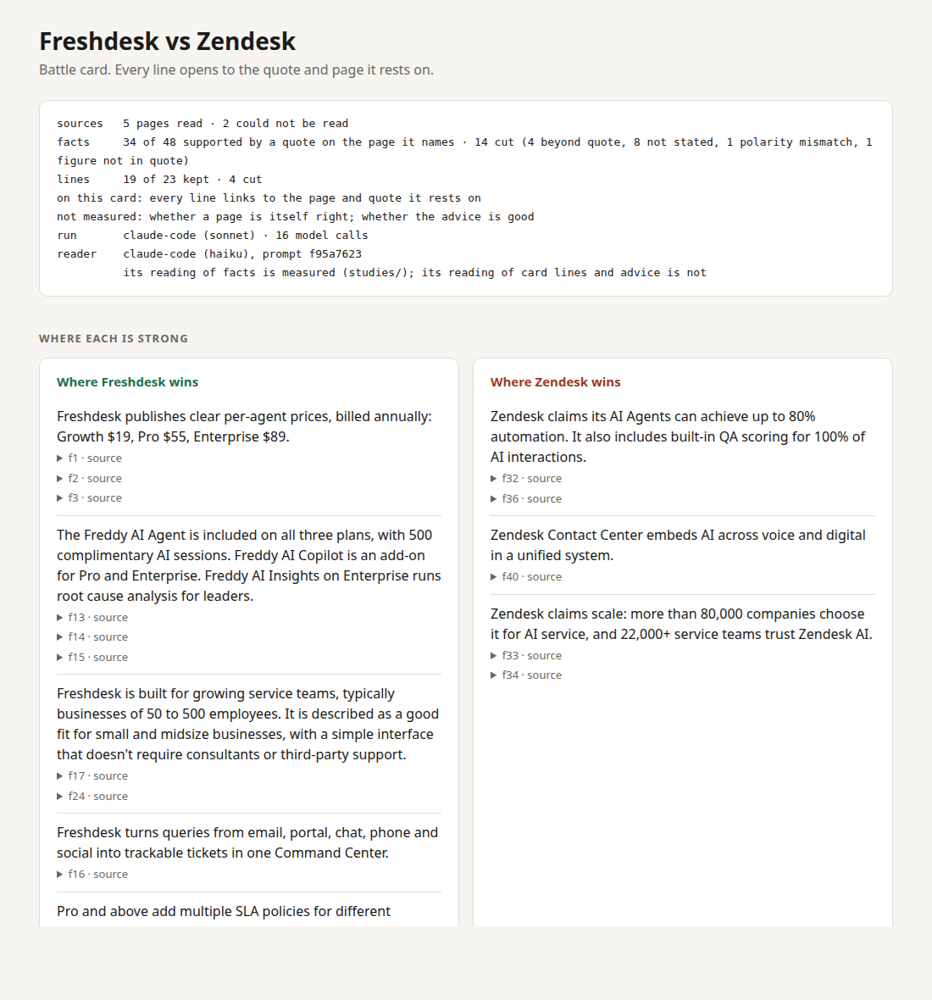

# receipts

[](https://github.com/yannickYamo/receipts/actions/workflows/ci.yml)

**receipts is a small Python package that sits between a research agent and the document a human will act on. Every claim the agent makes has to carry a verbatim quote from a page that code fetched, with a link and the date it was read. A claim the check can't tie to its quote gets cut, and the cut is listed with a reason. A model may point at evidence; only code may vouch for it.**

On 864 claims from 24 real pages, written by models of 3 families that were told to quote their source, 34% came with a quote that does not state the claim. After receipts, 12%. It kept 67% of the true ones. Only 9 of the 864 stated something the page does not, too few to say receipts catches inventions. It cut 33% of the true claims, most of all on pricing pages, where it kept 47%. Every bar, the ones it missed included, is in [EVALS.md](EVALS.md).



Core has no dependencies, needs Python 3.10+, and is MIT licensed. Repo: https://github.com/yannickYamo/receipts

## What it is

You hand it an agent's claims and the pages those claims name. You get back the claims that passed the check, each with its quote, its link, and the date it was read, plus a list of everything that was cut and why. It works with any agent's output and with page text from any fetcher.

It isn't a scraper, a search engine, or an eval dashboard. It's the step after those.

## Why you'd use it

You can repeat what the agent said, because every surviving claim is an exact quote plus a link. You don't redo the research, because checking a line is one click on the quote. A changed price is stopped by code, not by a model's judgment: if a figure in the claim isn't in the quoted sentence, the claim is cut, never quietly reworded into something softer. And you see the shape of what's missing - every cut is listed with a reason, and every page that couldn't be read is named.

It's cheap. The reader stage is a small model (claude-haiku-4-5): 120 claims read for $0.17 at list price. That was measured before the reader was shown the text around each quote, which makes its prompts longer.

**Three people keep showing up as the ones who need this.** A sales rep or product marketer who has to trust a battle card in front of a prospect. An engineer shipping an agent whose answers people act on. Anyone who has pasted agent research into a doc and then spent an hour checking it.

If your agent's output only ever gets read by you, and nobody acts on it, you probably don't need any of this. The guard earns its keep when someone downstream repeats a number out loud.

## How to use it

```bash
pip install "git+https://github.com/yannickYamo/receipts@v0.2.0"
```

To work on it, or to run the evals, clone it and `pip install -e ".[dev,mcp]"`.

`check` runs **both** stages by default: the code check, then the reader. The reader runs on the local `claude` command (a Claude Code login), against the Anthropic API with `--backend anthropic`, or against any API that speaks OpenAI's chat completions, such as OpenAI or xAI, with `--backend openai --reader-model <model>`. The claims themselves can come from any model. The reader's measured rates are for claude-haiku-4-5 only. If your `claude` setup does not serve the short name `haiku`, pass a full model id: `--reader-model claude-haiku-4-5`. If the reader can't run, the claim is cut, not passed.

There's a `--code-only` flag: no model, runs anywhere, free. It's weaker, and that stage alone failed its own test, so the output says so when you use it.

The CLI exits 1 when any claim is unsupported, so it can stop a pipeline. It exits 3, and says why, when the reader gave no answer:

```bash
receipts fetch https://www.freshworks.com/freshdesk/pricing/ --ledger ledger.json
receipts check claims.json --ledger ledger.json
```

```text
PASS a  Freshdesk Growth plan costs $19/agent/month, billed annually.
CUT  b  Freshdesk Growth plan costs $15/agent/month, billed annually.
       the claim states a figure the quote does not (15)

1 of 2 supported, 1 cut
code check, then reader (claude-code (haiku), prompt 3e63cca8)
```

From Python:

```python
from receipts import Claim, Ledger
from receipts.backends import ClaudeCodeBackend
from receipts.reader import check_with_reader

ledger = Ledger()
page = ledger.add_url("https://www.freshworks.com/freshdesk/pricing/")
claim = Claim("a", text="Freshdesk Growth costs $19 per agent per month, billed annually",
              quote="Growth ... $19 /agent/month, billed annually", evidence_id=page.id, subject="Freshdesk")
report = check_with_reader([claim], ledger, ClaudeCodeBackend("haiku"))   # both stages
report.supported, report.cut, report.by_reason
```

The code stage alone is `receipts.check_claims(claims, ledger)`. No model, and weaker.

To let an agent check itself, run `receipts mcp` (it needs the `mcp` package: `pip install mcp`). Two tools, `read_page` and `check_claims_tool`, both stages by default, and every result names which stages ran. The agent can't hand in its own page text. To audit someone else's output, `receipts audit card.html` counts the specifics and how many of them sit on a line with a link.

## How it works

Five steps, and the split between them is the whole design.

1. Code fetches the page into a ledger: the text as served, the date, a hash. The model never supplies the evidence.
2. The model may only point. Each claim names a page and quotes it.
3. The code check: is the quote on that page word for word, is every figure in the claim present in the quote, is the page about the right product.
4. The reader, a small model, may only cut. It reads the claim against the whole sentence the quote sits in and answers one question: does the sentence state everything the claim states? It also sees the page on either side of that sentence, which can only count against the claim: the next sentence takes it back, or the price sits in another plan's row. No answer counts as no.
5. A failure is a cut. Never a rewrite. Always listed with its reason.

```text
  a web page                     a model's claim
      |                          "Growth costs $19"  + quote + page id
      v                                  |
+-------------+                          v
|   fetch     |   page text      +----------------+     fails     +---------------+
|  (code)     |----------------->|   code check   |-------------->|  cut, with    |
+-------------+   date, hash     |  quote on page |               |  the reason   |
                                 |  figures match |               +---------------+
                                 |  right subject |                       ^
                                 +----------------+                       |
                                         | passes                         |
                                         v                                |
                                 +----------------+      "no"             |
                                 |    reader      |-----------------------+
                                 | (small model)  |   or no answer
                                 | may only cut   |
                                 +----------------+
                                         | "yes"
                                         v
                              the claim, its quote, its link
```

**The authority never moves to the model.** It points, it cuts, and code decides what counts as evidence.

## An example

The worked example in the repo is a competitive battle card:

```bash
receipts card --us Freshdesk --them Zendesk --out out/
```

It finds pages on both products, fetches them, lists facts with quotes, checks the facts, writes lines from the facts that survived, checks the lines, and lays the result out from a fixed template. No model writes the HTML. Every line opens to its quote, its page, and the date it was read, and the top of the card says what was read and what was cut. It runs on the local `claude` command by default.

Here's the panel from a real run, with the card itself at `bench/live/run5/card.html`:

```text
sources   5 pages read · 2 could not be read
facts     34 of 48 supported by a quote on the page it names · 14 cut (4 beyond quote, 8 not stated, 1 polarity mismatch, 1 figure not in quote)
lines     19 of 23 kept · 4 cut
on this card: every line links to the page and quote it rests on
```

A line about us from that run: "Freshdesk publishes clear per-agent prices, billed annually: Growth $19, Pro $55, Enterprise $89." A line about them, which is there because the facts say so: "Zendesk claims its AI Agents can achieve up to 80% automation. It also includes built-in QA scoring for 100% of AI interactions." And the objection handling that follows from it - "That is their 'up to' claim. With Freshdesk, the Freddy AI Agent is on every plan with 500 complimentary AI sessions, so you can test it on your own tickets."

## Experiments, not measured

Two things are in the repo and carry no numbers yet. Treat them as experiments until they do.

**A brief on a company before you write to it.**

```bash
receipts brief --sell "a help desk for support teams" --company https://example.com --out out/
```

Code reads the company's home page and follows its own links to its news, careers and about pages. A model lists signals from them, such as a new office, open roles or a launch, and each signal goes through the same check. You get what the company's own pages say, why that might matter to you now, and a draft first message in which every sentence about the company opens to its quote. What you sell is taken in your own words and isn't checked. Facts about a named person are left out. The plan for measuring it is `studies/BRIEF_PREREGISTRATION.md`.

**A reader that answers with a probability.** `receipts.decision` runs the reader's stage on a model built to decide, so how strict the reader is becomes a number you set. It isn't on the command line. The plan for putting it beside the measured reader is `studies/BAKEOFF_PREREGISTRATION.md`.

## Why I built it

My agents hand me fluent prose full of prices, ratings and customer counts. Some of it is right. I can't tell which parts without redoing the research, so the time I saved comes straight back as checking.

The specific trigger was the [AI Sales Intelligence Agent Team](https://github.com/Shubhamsaboo/awesome-llm-apps/tree/main/advanced_ai_agents/multi_agent_apps/agent_teams/ai_sales_intelligence_agent_team) by Shubham Saboo, in awesome-llm-apps. It's a good, clear example: seven agents that write a sales battle card. I ran its prompts on its own sample request, "Help me compete against Zendesk, I sell Freshdesk", on Claude Sonnet rather than the Gemini it ships with. The card came back with 175 specifics a pattern can find - prices, ratings, counts, dates. Zero of them sat on a line with a link. The model wrote VERIFY on its own output 23 times.

I didn't show its figures were wrong. Its Zendesk list prices match Zendesk's own pricing page. The problem is that a rep can't tell which ones are right, because prose passes from agent to agent and no address survives the trip. One wrong price repeated in front of a prospect loses the room.

The check itself came out of my other project, [Atelier](https://github.com/yannickYamo/atelier), which has an invented-claim check built the same way: a small model reads, code decides. receipts is that idea pointed at web research, where the evidence is a page instead of the author's notes.

**The design is mostly a record of my own mistakes.** The first version accepted a quote of "$19" on a page that says "$199"; an independent audit caught it. The code check alone failed its own test, 43 of 50 against a bar of 45, because it can't tell "A acquired B" from "B acquired A" - that failure is why the reader stage exists. A red team clipped "$425" out of "$425 million" and got through, so now code widens every quote to its whole sentence before anyone reads it. And after I published, an outside review found that `receipts check`, the front door, ran only the code stage: the one that had failed its own test. I had built the reader and then left it out of the default path. Both stages are the default now, and the weaker path has to be asked for by name.

## How it compares

Read from each vendor's own docs on 2026-10-04. The open job is narrow: check each claim against the page it cites, and remove what the page doesn't state.

| Tool | What it is for | Does it check a claim against the page it cites? |
|---|---|---|
| [Firecrawl](https://docs.firecrawl.dev/introduction), [Jina Reader](https://jina.ai/reader/) | Getting the page: scrape, crawl, search. They handle JavaScript rendering, proxies and anti-bot | No. They are fetchers, and better ones than the fetcher in receipts |
| [Tavily](https://docs.tavily.com/documentation/api-reference/endpoint/search), [Exa](https://exa.ai/docs/reference/answer), [Perplexity Sonar](https://docs.perplexity.ai/docs/sonar/quickstart), [OpenAI web search](https://developers.openai.com/api/docs/guides/tools-web-search) | Finding pages and answering with a list of sources | No. A citation is a source the answer used, not a quote that was checked |
| [Anthropic Citations](https://platform.claude.com/docs/en/build-with-claude/citations) | Claude cites exact passages from documents you supply | Partly. The cited text is guaranteed to be in the document. Whether it supports the claim is not checked, and nothing is removed |
| [Guardrails AI provenance](https://guardrailsai.com/hub/validator/guardrails/provenance_llm), [NeMo Guardrails fact-checking](https://docs.nvidia.com/nemo/guardrails/configure-guardrails/guardrail-catalog/fact-checking) | A guard in the loop: a model judges whether text is supported by sources | Partly. It is a model's judgment with no verbatim quote. NeMo blocks the whole reply below a score |
| [Ragas](https://docs.ragas.io/en/stable/concepts/metrics/available_metrics/faithfulness/), [DeepEval](https://deepeval.com/docs/metrics-faithfulness) faithfulness | Evaluation: the share of claims an LLM judge finds supported, as a score | Partly. They score the output. They do not edit it |
| **receipts** | Checking: each claim tied to a verbatim quote on a page that code fetched | Yes. Unsupported claims are cut and listed with the reason |

These work together. Firecrawl reads pages the fetcher in receipts can't - JavaScript pages, sites that refuse a plain request - and you hand its text straight to the ledger:

```python
ledger = Ledger()
page = ledger.add_text(url, text_from_any_fetcher, title)   # Firecrawl, Jina Reader, your own crawler
report = check_with_reader(claims, ledger, reader)
```

A search tool finds the pages, a fetcher reads them, receipts decides what the agent is allowed to say about them.

## What it doesn't do yet

It cuts true facts. One in three across the 24 pages of round 3, and about half on pricing pages, where a value sits apart from the name it belongs to. On a live battle card it kept 43 of 56 true facts, under the bar of 80% set for it. The trade is deliberate: cutting a true line costs you a line, keeping a false one costs the rep the room, and this is built for the second.

It isn't shown to catch inventions. Models told to quote their source rarely state something the page doesn't (9 claims in 864), which is too few to measure a catch rate on. What it removes is the claim whose quote doesn't back it.

It doesn't stop someone who writes claims specifically to beat it. It doesn't know whether a page is right - point it at a wrong page and you get a well-sourced wrong claim.

Some pages can't be read, and it doesn't try to get round a site that says no. The plain fetcher reads what a site serves to a simple request. For a page whose text arrives by JavaScript there are two more ways, `--fetcher browser` (a headless browser; `pip install playwright`) and `--fetcher firecrawl` (your Firecrawl key). On a fixed list of 40 pages the plain fetcher read 35 and the browser 36, with much more text on four of them. Review sites such as G2 and Capterra refuse automated reading with a 403 or a bot check, whichever way is used, and none of them was read. For those, save the page from your own browser and hand it in with `receipts add page.html --url ...`. Every source on a card says how it got there: fetched by code, rendered by a browser, returned by a service, or supplied by you.

A ledger file is trusted input. Loading refuses page text that no longer matches its hash, which catches an edit or a damaged file, but whoever can edit the text can edit the hash. The MCP server fetches addresses a model chose; private and local addresses are refused, and the connection goes to the address that was checked, so a host can't answer one thing to the check and another to the fetch.

What was tested, what passed and what failed, with the failures kept in, is in [EVALS.md](EVALS.md). The results for the reader in this version are round 3, and EVALS.md says which reader each number is for.

## Structure

```text
src/receipts/core.py         the code check          src/receipts/reader.py      the reader stage
src/receipts/ledger.py       pages, dates, hashes    src/receipts/audit.py       count specifics in any text
src/receipts/battlecard/     the worked example      src/receipts/mcp_server.py  the check as an MCP server
src/receipts/brief/          experiment: a brief on a company before you write to it
src/receipts/decision.py     experiment: the reader's stage on a decision model
bench/                       test sets, red-team sets, labels, saved model answers, live runs
studies/                     the pre-registrations, the evaluation plan and the full results
EVALS.md                     what was tested, what passed and what failed
SECURITY.md                  what it is built to withstand, and how to report a problem
CHANGELOG.md                 what changed in each version
BACKLOG.md                   what is left out on purpose
```

Licensed MIT. The bench corpus is Wikipedia text, CC BY-SA 4.0.

receipts doesn't make the agent trustworthy. It moves the trust off the agent's prose and onto a page you can open.
